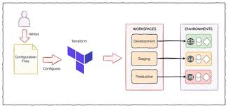

# Terraform Multi-Environment Setup 🌍

This project demonstrates how to use **Terraform Workspaces** to manage multiple environments — `dev`, `qa`, and `prod` — using AWS EC2 instances.

## 🏗️ Project Overview
- **Provider:** AWS  
- **Infrastructure:** EC2 Instances  
- **Automation:** Terraform Workspaces  
- **Environments:** dev / qa / prod  

## 🧱 Structure


terraform-multi-env/
├── main.tf
├── ec2.tf
├── variables.tf
├── outputs.tf
└── terraform.tfvars


## ⚙️ Commands
```bash
terraform init
terraform workspace new dev
terraform workspace select dev
terraform plan
terraform apply


## 🧭 Terraform Workspace Architecture

This diagram illustrates how multiple environments (Dev, QA, and Prod) are managed using Terraform workspaces.




## 🧭 Roboshop Infrastructure Architecture


